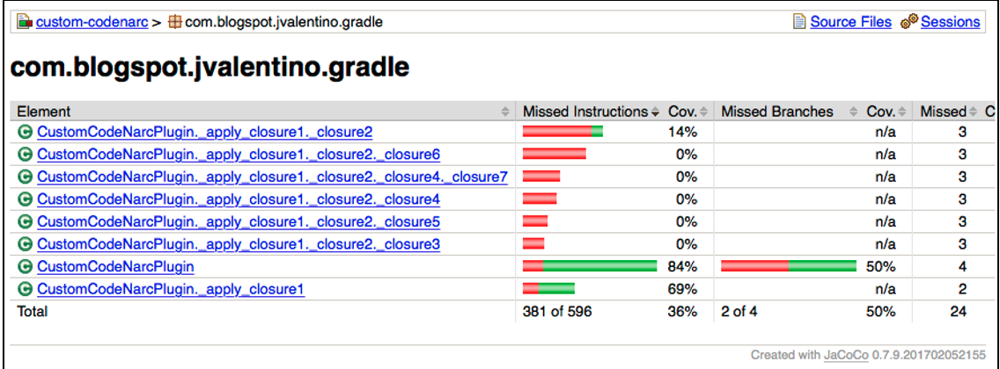
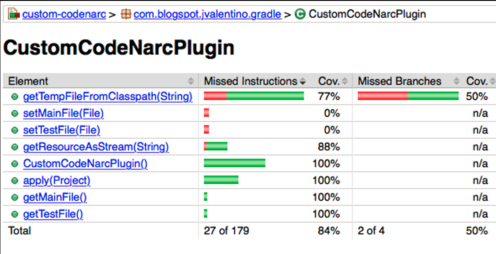
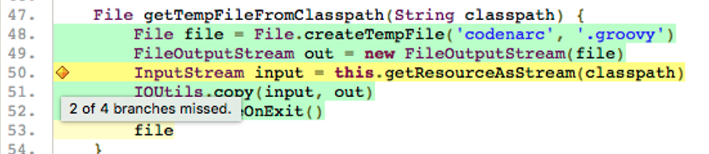
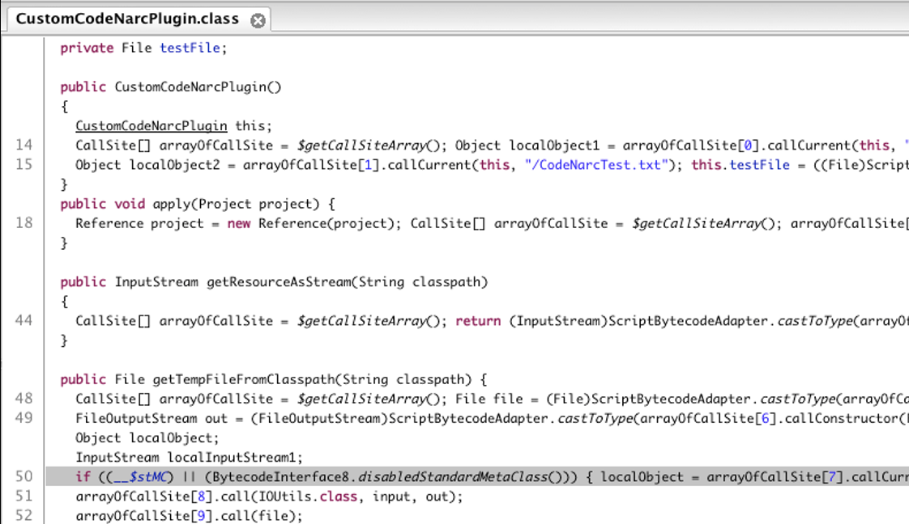
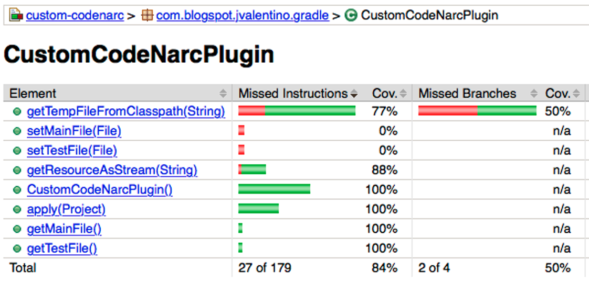
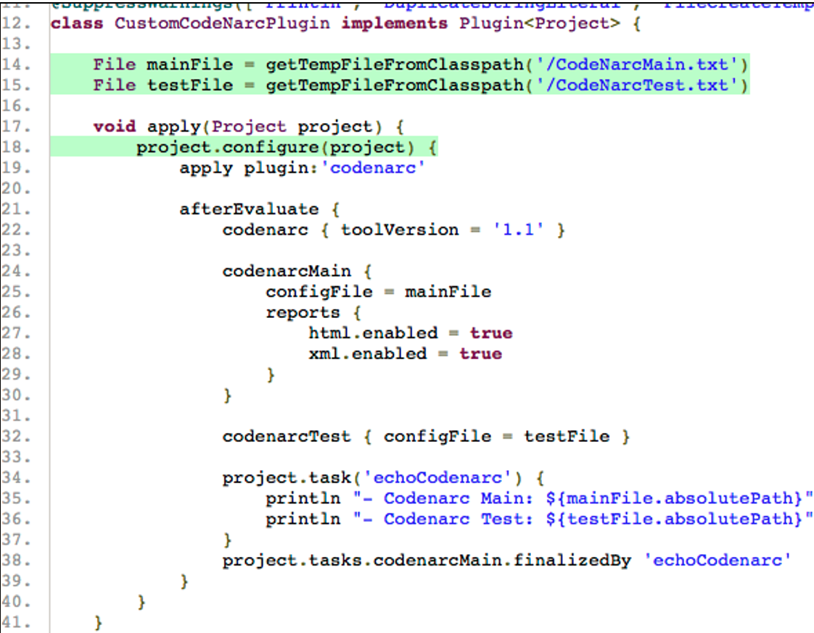

## 5.2 Common JaCoCo

Just as with the Codenarc plugin, the Jacoco plugin has been used in the various example project and involves the copying and pasting of boilerplate code. While the same approach can be used for creating a common Jacoco plugin to be applied across multiple projects, there first needs to be an understanding of how code coverage works in Groovy versus Java.

### 5.2.1 Groovy, Code Coverage, and You

**Reference**: custom-codenarc 

​      The **custom-codenarc** project is used to demonstrate how code coverage works in Groovy, because of the large closures and Groovy enhanced classes involved. Groovy closures and other enhancements result in additional bytecode being generated at compile-time, which equates to additional code be used. This additional code makes branch coverage in Groovy not useful.

​      Commonly in a Groovy code coverage report, a single statement of code with no branching will show as have multiple branches missed. This is because that single line of code, resulted in multiple lines of bytecode where that first line contains two or more branches. This is why line coverage alone is used for evaluating Groovy code coverage.

#### src/main/groovy/com/blogspot/jvalenitno/gradle/CustomCodeNarcPlugin.groovy

```groovy
class CustomCodeNarcPlugin implements Plugin<Project> {

    File mainFile = getTempFileFromClasspath('/CodeNarcMain.txt')
    File testFile = getTempFileFromClasspath('/CodeNarcTest.txt')

    void apply(Project project) {
        project.configure(project) {
            apply plugin:'codenarc'

            afterEvaluate {
                codenarc { toolVersion = '1.1' }

                codenarcMain {
                    configFile = mainFile
                    reports {
                        html.enabled = true
                        xml.enabled = true
                    }
                }

                codenarcTest { configFile = testFile }

                project.task('echoCodenarc') {
                    println "- Codenarc Main: ${mainFile.absolutePath}"
                    println "- Codenarc Test: ${testFile.absolutePath}"
                }
                project.tasks.codenarcMain.finalizedBy 'echoCodenarc'
            }
        }
    }

    InputStream getResourceAsStream(String classpath) {
        this.getClass().getResourceAsStream(classpath)
    }

    File getTempFileFromClasspath(String classpath) {
        File file = File.createTempFile('codenarc', '.groovy')
        FileOutputStream out = new FileOutputStream(file)
        InputStream input = this.getResourceAsStream(classpath)
        IOUtils.copy(input, out)
        file.deleteOnExit()
        file
    }
}

```

The CustomCodeNarcPlugin class is used for demonstration purposes, as it specifically contains closures and enhanced Groovy methods.

#### Code Coverage Package Summary



When looking at the package level summary of the code coverage report, while there is only one class in this package, several classes show. This is because the various closures in bytecode are represented as independent classes. Those classes show missed lines relative to the generated bytecode.

#### Code Coverage Class Summary



The class level code coverage shows missed lines, even though all lines of all methods are covered in the unit test. 

#### apply method code coverage: understanding closure coverage


Lines 22-38 are uncovered, because the belong to another class in the bytecode representation.

##### getTempFileFromClasspath method code coverage: understanding enchancement



Line 50 shows that 2 out of 4 branches are missed, even though this is one line not involving “if” or any type of branching statement.

#### Jar decompiling



Tools such as JD-GUI (http://jd.benow.ca/) have the ability to decompile a Jar. This process takes the .class files and attempts to turn them back into the .java files that generated them. This can be used see what happens when Groovy code is turned into .class files, specifically the extra codes that is added.

#### CustomCodeNarcPlugin.class (line 50)

```java
if ((__$stMC) || (BytecodeInterface8.disabledStandardMetaClass())) { 
    localObject = arrayOfCallSite[7].callCurrent(this, classpath); 
    input = (InputStream)ScriptBytecodeAdapter.castToType(localObject, InputStream.class); 
} else { 
    localInputStream1 = getResourceAsStream(classpath); 
    input = localInputStream1; 
}

```

If you look at the line from the **getTempFileFromClasspath** method that calls **this.getResourceAsStream**, it is represented in Java by the code at line 50 from the de-compilation. This is the source of the “2 of 4 branches” missed warning. That single line in Groovy resulted in several lines of equivalent Java being generated, consisting of four branches.

#### build.gradle

```groovy
jacocoTestReport {
    doFirst {
        classDirectories = classDirectories.collect { 
            fileTree(it) { exclude '**/*$*_closure*' } 
        }.sum()
    }
	reports {
		xml.enabled true
		csv.enabled false
		html.enabled true
	}
}

jacocoTestCoverageVerification {
    doFirst {
        classDirectories = classDirectories.collect { 
            fileTree(it) { exclude '**/*$*_closure*' } 
        }.sum()
    }
}

```

Due to the infesbility of tesing closures, it is sometimes best to ignore them in code coverage reporting and verification. However, doing so so leave codes untested. It is for this reason that closures are used carefully with this knowledge, and it best to have closures involve other methods to assist in coverage.

#### Reporting post closure ignoring



The class level summary report shows that the **apply** method is now 100% covered.



However, the code per the source code level report shows that this code is uncovered with no warning now.

